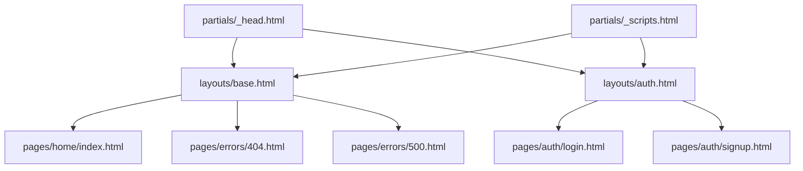

# roadSOS Frontend Architecture

This document outlines the frontend code structure, CSS compilation layers, HTML template distribution, and scripting architecture for **roadSOS**.

---

## 1. Directory Structure

The frontend is housed entirely within the Flask application's static directory and template registry, ensuring clean server-side rendering while maintaining high modularity.

```text
backend/app/
├── static/
│   ├── css/
│   │   ├── components/
│   │   │   └── button.css      # Reusable UI component styling
│   │   ├── _base.css           # Typography, global settings, tag defaults
│   │   ├── _reset.css          # Core CSS browser normalization
│   │   ├── _tokens.css         # Design system custom properties (variables)
│   │   ├── _utilities.css      # Helper properties, layout layouts, shadows
│   │   └── main.css            # Master entry file, imports sub-stylesheets
│   └── js/
│       ├── core/
│       │   ├── api.js          # REST integration module
│       │   └── state.js        # Global state storage
│       └── main.js             # General page interactive events
└── templates/
    ├── components/
    │   └── button.html         # Jinja reusable button macro definition
    ├── layouts/
    │   ├── base.html           # Main dashboard template
    │   └── auth.html           # Authentication pages (login/signup) base layout
    ├── pages/
    │   ├── auth/
    │   │   ├── login.html      # Authentication portal login form
    │   │   └── signup.html     # Portal registration form
    │   ├── errors/
    │   │   ├── 404.html        # Not Found template
    │   │   └── 500.html        # Server error template
    │   └── home/
    │       └── index.html      # Main roadside dashboard
    └── partials/
        ├── _head.html          # Global document metadata and font scripts
        └── _scripts.html       # Application javascript script inclusions
```

---

## 2. CSS Architecture (Vanilla Modular Import)

To ensure high modularity without bloating compilation pipelines, we use pure CSS imports. `main.css` imports files sequentially. The order is extremely critical to maintain proper cascading override behaviors:

```css
/* main.css */
@import url("_tokens.css");      /* Layer 1: Core Design Variables */
@import url("_reset.css");       /* Layer 2: Baseline Normalize */
@import url("_base.css");        /* Layer 3: Typography and default HTML tags */
@import url("_utilities.css");   /* Layer 4: Structural grids, layouts, gradients */
@import url("components/button.css"); /* Layer 5: Specific reusable UI controls */
```

### Advantages:
- **No Compilation Required**: The browser imports sub-styles directly during local development, keeping deployment instant.
- **Zero Third-Party Dependency**: No Tailwind, Bootstrap, or custom preprocessors, minimizing asset footprint for weak roadside cellular signals.
- **High Modularity**: Component-specific styles (such as button definitions) remain fully isolated.

---

## 3. Template Inheritance Structure

We leverage Flask's native Jinja2 engine to support dry, hierarchical template inheritance.



### Custom Block Definitions:
- ``: Enables custom pages to append unique SEO tags or page-specific styling imports.
- ``: The core template block where view content is rendered.
- ``: Enables insertion of page-specific client-side scripts.

---

## 4. Javascript Core

A clean, non-obtrusive scripting structure supports asynchronous server updates.
1. `core/api.js`: Standardizes all `fetch()` operations, handling global errors, CSRF tokens, and response parse formatting.
2. `core/state.js`: A lightweight, event-driven reactive state repository for storing client status, current geo-coordinates (crucial for SOS tracking), and user contexts.
3. `main.js`: Hooks global actions, like mobile drawer toggling, notification dismissals, and service click bindings.
